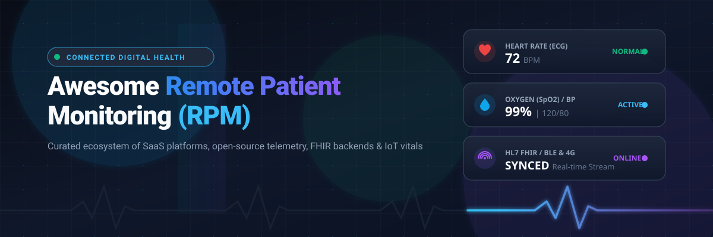

<div align="center">

# 🩺 Awesome Remote Patient Monitoring (RPM)

[](https://github.com/ishandutta2007/Awesome-Awesome-Awesome)<a href="https://discord.gg/jc4xtF58Ve"></a>
<a href="https://github.com/ishandutta2007/Awesome-Remote-Patient-Monitoring/stargazers"></a>
<a href="https://github.com/ishandutta2007/Awesome-Remote-Patient-Monitoring/network/members"></a>
<a href="https://github.com/ishandutta2007/Awesome-Remote-Patient-Monitoring/blob/main/LICENSE"></a>
<a href="https://github.com/ishandutta2007/Awesome-Remote-Patient-Monitoring/pulls"></a>
<a href="https://github.com/ishandutta2007"></a>

<p align="center">
  
</p>

**A curated list of Remote Patient Monitoring (RPM) SaaS platforms, connected medical IoT devices, open-source telehealth backends, HL7 FHIR pipelines, chronic care management (CCM), and hospital-at-home frameworks.**

</div>

---

## 📑 Table of Contents

- [🌐 Overview](#-overview)
- [🏢 SaaS & Hosted Commercial Platforms](#-saas--hosted-commercial-platforms)
- [💻 Open-Source GitHub Projects](#-open-source-github-projects)
- [🏗️ Recommended Architecture Stack](#️-recommended-architecture-stack)
- [📈 Star History](#-star-history)
- [🤝 How to Contribute](#-how-to-contribute)
- [⚠️ Disclaimer](#️-disclaimer)

---

## 🌐 Overview

**Remote Patient Monitoring (RPM)** empowers clinicians to gather and analyze patient-generated health data (PGHD) outside conventional clinical settings using cellular and Bluetooth medical devices (blood pressure cuffs, continuous glucose monitors, pulse oximeters, ECG patches, spirometers, and weight scales). 

RPM infrastructure automates vital sign ingestion, physiological threshold alerting, CMS CPT billing workflows (e.g., 99453, 99454, 99457, 99458), EHR bi-directional syncing via HL7 FHIR, and decentralized hospital-at-home care models.

---

## 🏢 SaaS & Hosted Commercial Platforms

> 📊 **Market Size & Landscape:** The global Remote Patient Monitoring market is valued at **~$53.6 Billion in 2026** (projected to reach **$175B+ by 2032** at an 18.5% CAGR). The sector is **moderately to highly fragmented** rather than a winner-take-all monopoly, characterized by specialized disease verticals (cardiology, oncology, diabetes, respiratory), diverse cellular hardware ecosystems, regional compliance frameworks (US HIPAA/FDA vs. EU MDR/NHS Virtual Wards), and localized EHR integration channels.

*Sorted descending by company size, parent valuation, or annual revenue:*

| Product | Company Size / Valuation / Revenue | Description | Starting Pricing | Free Tier / Trial Limit |
| :--- | :--- | :--- | :--- | :--- |
| **Philips eCareCoordinator** | ~$26B Market Cap / ~$20B Annual Revenue *(Philips NV)* | Enterprise telehealth and clinical RPM platform supporting multi-parameter vital monitoring, population dashboards, and virtual-care workflows. | Starts at $2,500/month department license (~$50–$120/patient/month depending on hardware kit) | 30-day clinical sandbox trial (limited to department evaluation access with simulated patient vital streams) |
| **Current Health** | Acquired for $400M / Parent Best Buy ~$18B Market Cap ($43B Rev) | Enterprise hospital-to-home platform combining continuous wearable biosensors, cellular gateway kits, patient tablets, and 24/7 clinical triage. | Starts at $150/patient/month (includes wearable continuous vital sensors, cellular hub, and clinical triage) | 30-day hospital-to-home evaluation pilot (limited to a clinical cohort of up to 10 trial patients) |
| **eClinicalWorks (healow RPM)** | ~$4B+ Est. Valuation / ~$800M+ Annual Revenue | Comprehensive patient-facing digital health ecosystem and EHR suite supporting RPM device data sync, telehealth visits, and care management. | Starts at $449/provider/month (base EHR platform) + $10/patient/month (healow RPM add-on module) | 30-day provider sandbox trial / interactive demo environment (limited to 1 test provider account and sample patient EHR records) |
| **Teladoc Health Chronic Care** | ~$1.8B Market Cap / ~$2.6B Annual Revenue *(NYSE: TDOC)* | Comprehensive chronic-condition management ecosystem (formerly Livongo) providing connected cellular glucose/BP meters, digital coaching, and RPM. | Starts at $45/enrolled member/month (includes cellular-connected glucose/BP meters, test strips, and coaching) | 30-day organizational pilot evaluation (limited to an employee health cohort of up to 20 enrolled members) |
| **Biofourmis** | $1.3B Valuation *(Unicorn)* / $150M+ Series D | AI-powered digital health and RPM platform utilizing continuous wearable sensors, predictive clinical analytics (Biovitals), and hospital-at-home pathways. | Starts at $120/patient/month (Biovitals platform tier + biosensor monitoring streams) | 30-day clinical department evaluation trial (limited to 5–10 enrolled cohort patients) |
| **Cadence** | $1.05B Valuation *(Unicorn)* / $100M Series B | Tech-enabled chronic care management and RPM platform partnering with health systems, combining cellular vitals tracking with dedicated clinical care teams. | Starts at $35/active patient/month (per-active-patient model; no upfront software licensing fee) | 60-day phased clinical pilot (limited to an initial patient cohort of 10–20 enrolled patients) |
| **Huma** | $1.0B Valuation *(Unicorn)* / $300M+ Total Funding | Modular digital health platform providing remote monitoring, companion apps, predictive risk algorithms, and disease-specific digital care pathways. | Starts at €8/patient/month (~$9/patient/month for modular RPM care pathways) | 14-day free trial / developer sandbox (limited to 1 configured clinical pathway and up to 10 test patient profiles) |
| **Medically Home** | ~$500M+ Valuation / $275M+ Funding *(Baxter, Mayo, Kaiser)* | Decentralized hospital-at-home care engine providing high-acuity virtual command center software, rapid response logistics, and medical telemetry. | Starts at $200/acute patient/episode (integrated virtual command center software + logistics orchestration) | 60-day health system feasibility trial (limited to a designated hospital unit and up to 10 acute-at-home beds) |
| **Tunstall Healthcare** | ~$350M–$500M Valuation / ~$250M Annual Revenue | Pioneer in connected health and telecare solutions, offering remote patient vital sign hubs, 24/7 triage software, and assisted-living integrations. | Starts at $30/monitored user/month (software & triage gateway license + hardware terminal fees) | 30-day pilot evaluation program (limited to 1 clinical care team and up to 5 monitoring units) |
| **TytoCare** | ~$350M Valuation / $185M Total Funding | FDA-cleared remote physical examination kit and telehealth platform allowing clinicians to examine heart, lungs, ears, throat, and skin remotely. | Starts at $299 (TytoHome consumer kit) or $999 (TytoPro clinical device) + $30/month clinician portal license | 30-day institutional evaluation pilot (includes 1 evaluation examination kit and clinician portal access) |
| **Withings Health Solutions** | ~$250M+ Valuation / ~$100M Annual Revenue | Medical-grade connected hardware ecosystem (cellular scales, BP monitors, sleep mats) paired with B2B Data APIs and Withings+ patient subscriptions. | Starts at $9.95/month (Withings+ subscription) or $5–$15/device/month (Health Solutions Pro API tier) | 14-day free trial on Withings App (or 1-month trial with hardware purchase); Free developer API sandbox for integration testing |
| **Validic** | ~$200M–$300M Valuation / >$30M ARR | Industry-standard health IoT infrastructure normalizing biometric telemetry from 700+ consumer and clinical devices directly into EHRs. | Starts at $15/user/month (or $500/month base platform fee for Business tier) | Free Forever Developer Tier (5 active users, 5 cloud device integrations, REST/streaming API sandbox, 90-day data retention) |
| **Validic Inform** | ~$200M–$300M Valuation *(Validic Platform)* | Dedicated real-time data streaming engine delivering normalized continuous vitals streams to health systems via Server-Sent Events (SSE) and webhooks. | Starts at $15/connected user/month (production tier scaled by data throughput) | Free Forever Developer Tier (5 users, 5 data source connectors, 90-day retention, full developer sandbox) |
| **Health Recovery Solutions (HRS)** | ~$180M–$250M Valuation / ~$35M ARR | Turnkey RPM and transitional care management platform with 4G tablets, pre-paired Bluetooth vitals kits, video visits, and clinical monitoring services. | Starts at $35/patient/month (software-only) or ~$150/patient/month (with cellular tablet & biometric kit) | 30-day clinical evaluation pilot (limited to 10 enrolled patients with standard vitals monitoring) |
| **Vivify Health** | Acquired for ~$150M / Parent UHG ~$480B Market Cap | Cloud-native remote care management platform offering BYOD mobile apps (Vivify Go) and pre-configured cellular kits (Vivify Complete) for chronic care. | Starts at $30/patient/month (Vivify Go BYOD tier) or ~$75/patient/month (Vivify Complete cellular tablet kit) | 30-day enterprise evaluation pilot (limited to 10 patient licenses with sample disease management protocols) |
| **Care Innovations** | Acquired / Parent ICON plc ~$18B Market Cap | Health Harmony RPM platform (formerly Intel-GE Care Innovations) supporting chronic disease management, protocol-driven workflows, and clinician portals. | Starts at $40/patient/month (software platform tier) or ~$80/patient/month (with multi-device peripheral bundle) | 30-day clinical proof-of-concept trial (limited to 10 enrolled patients and core clinical dashboard access) |
| **100Plus** | Acquired by Connect America (~$100M Valuation) | Turnkey, Medicare-reimbursable RPM platform shipping pre-configured cellular devices (BP cuff, scale, glucometer) with automated AI patient outreach. | Starts at $40/active patient/month (turnkey RPM bundle including cellular hardware) | 30-day provider evaluation pilot (includes up to 5 starter cellular device units and test enrollments) |
| **Optimize Health** | ~$80M–$120M Valuation / $20M+ Funding | Modern RPM & CCM platform designed for medical practices and health systems to track physiological readings, manage alerts, and optimize CPT billing. | Starts at $15/patient/month (software platform tier) or ~$45/patient/month (with managed clinical support) | 14-day interactive sandbox trial (limited to test clinician accounts and 5 simulated patient profiles) |
| **CoachCare** | ~$50M–$80M Valuation / $15M+ Funding | Integrated remote patient monitoring, chronic care management, and behavioral coaching platform with customizable mobile apps and CPT automation. | Starts at $45/provider/month platform fee + $15/patient/month for RPM/CCM modules | 14-day trial sandbox (limited to 1 provider account and up to 5 demo patient records) |
| **Luscii** | ~$40M–$70M Valuation / NHS Virtual Ward Leader | Leading European "virtual ward" and remote clinical monitoring application supporting automated triage protocols, patient surveys, and hospital-at-home. | Starts at £12/patient/month (~$15/patient/month "Step-in" license) or £1,500/month (~$1,950/month unlimited department license) | 30-day virtual ward trial pilot (limited to 1 clinical department and up to 15 trial patients) |
| **Prevounce** | ~$30M–$50M Valuation / High-Growth RPM Vendor | Cloud-based software suite built for practices and ACOs, streamlining RPM, Chronic Care Management (CCM), and Annual Wellness Visits (AWV). | Starts at $150/month base practice tier (or ~$10–$20/active patient/month) | 30-day practice trial pilot (limited to onboarding 1 clinical team and up to 5 test patients with automated CPT tracking) |
| **Datos Health** | ~$30M–$50M Valuation / Series A Funded | No-code automated care pathway platform that ingests remote patient data to automate routine check-ins, medication adherence, and clinical escalation. | Starts at $20/patient/month (or $1,200/month practice tier) | 30-day pilot trial / sandbox (limited to 2 automated care pathways and up to 10 test patient journeys) |
| **Aiva Health** | ~$20M–$40M Valuation / Google & Cedars-Sinai Backed | Voice-driven clinical operating platform for smart bedside assistants and RPM voice check-ins across smart speakers and mobile devices. | Starts at $25/room/month (Essential tier) or $60/room/month (Professional tier) | Free Forever Starter Tier (limited to 1 device/room with core voice requests); 14-day full trial for multi-room deployment |

---

## 💻 Open-Source GitHub Projects

*Sorted descending by GitHub stars:*

1. [**Grafana**](https://github.com/grafana/grafana) [](https://github.com/grafana/grafana/stargazers) — Multi-platform open-source analytics and interactive visualization web application for composing real-time clinical vital sign dashboards, ECG waveform graphs, and alert thresholds.
2. [**Apache Superset**](https://github.com/apache/superset) [](https://github.com/apache/superset/stargazers) — Enterprise-ready business intelligence and data exploration platform tailored for population-level RPM epidemiology, chronic disease cohort tracking, and clinician billing analytics.
3. [**MinIO**](https://github.com/minio/minio) [](https://github.com/minio/minio/stargazers) — High-performance S3-compatible object storage server ideal for self-hosting raw continuous ECG waveforms, medical imaging files (DICOM), audio/video telehealth archives, and audit logs.
4. [**Keycloak**](https://github.com/keycloak/keycloak) [](https://github.com/keycloak/keycloak/stargazers) — Open-source identity and access management (IAM) delivering HIPAA/GDPR-compliant authentication, OAuth2/OIDC SSO, and fine-grained role-based access for patient and clinician apps.
5. [**Apache Kafka**](https://github.com/apache/kafka) [](https://github.com/apache/kafka/stargazers) — Distributed event streaming architecture capable of handling millions of concurrent physiologic telemetry messages per second from cellular hubs and connected sensors.
6. [**Jitsi Meet**](https://github.com/jitsi/jitsi-meet) [](https://github.com/jitsi/jitsi-meet/stargazers) — Fully encrypted 100% open-source video conferencing solution that seamlessly embeds into remote patient check-in portals and telehealth clinical workflows.
7. [**Apache Flink**](https://github.com/apache/flink) [](https://github.com/apache/flink/stargazers) — Stateful distributed stream processing engine engineered for real-time anomaly detection, sliding-window vitals analysis, and early clinical deterioration alarms.
8. [**Node-RED**](https://github.com/node-red/node-red) [](https://github.com/node-red/node-red/stargazers) — Low-code event-driven flow programmer for wiring together BLE medical peripherals, serial streams, MQTT messaging topics, database storage, and webhook notifications.
9. [**TimescaleDB**](https://github.com/timescale/timescaledb) [](https://github.com/timescale/timescaledb/stargazers) — Relational time-series database built on PostgreSQL, optimized for fast analytical queries and hypertables over continuous vital signs (SpO2, multi-lead ECG, blood glucose).
10. [**ThingsBoard**](https://github.com/thingsboard/thingsboard) [](https://github.com/thingsboard/thingsboard/stargazers) — Open-source IoT platform for connected medical hardware management, device credential provisioning, MQTT/CoAP/HTTP telemetry collection, and customizable patient dashboards.
11. [**PostgreSQL**](https://github.com/postgres/postgres) [](https://github.com/postgres/postgres/stargazers) — Industrial-strength open-source relational database storing clinical schemas, structured patient records, FHIR JSON documents, and billing audit logs.
12. [**Eclipse Mosquitto**](https://github.com/eclipse-mosquitto/mosquitto) [](https://github.com/eclipse-mosquitto/mosquitto/stargazers) — Lightweight MQTT message broker suitable for low-power medical microcontrollers, smart home health hubs, and edge devices.
13. [**OpenTelemetry Collector**](https://github.com/open-telemetry/opentelemetry-collector) [](https://github.com/open-telemetry/opentelemetry-collector/stargazers) — High-performance proxy receiving, processing, and exporting distributed traces, metrics, and logs across mission-critical RPM data pipelines.
14. [**ResearchKit**](https://github.com/ResearchKit/ResearchKit) [](https://github.com/ResearchKit/ResearchKit/stargazers) — Open-source software framework for iOS that lets researchers and developers build visual consent flows, dynamic health surveys, and biometric sensor-gathering apps.
15. [**OpenEMR**](https://github.com/openemr/openemr) [](https://github.com/openemr/openemr/stargazers) — ONC-certified open-source electronic health records (EHR) and medical practice management application with integrated FHIR REST APIs and telehealth modules.
16. [**Synthea**](https://github.com/synthetichealth/synthea) [](https://github.com/synthetichealth/synthea/stargazers) — Synthetic patient generator that outputs realistic, simulated patient health histories and continuous biometric telemetry for validating RPM architectures without HIPAA risks.
17. [**Nightscout (cgm-remote-monitor)**](https://github.com/nightscout/cgm-remote-monitor) [](https://github.com/nightscout/cgm-remote-monitor/stargazers) — Open-source web-based remote continuous glucose monitoring (CGM) engine visualizing real-time interstitial glucose telemetry for patients, parents, and caregivers.
18. [**Medplum**](https://github.com/medplum/medplum) [](https://github.com/medplum/medplum/stargazers) — Developer-centric, FHIR-native headless healthcare backend, clinical data repository (CDR), and React UI toolkit for building modern connected RPM applications.
19. [**Apple CareKit**](https://github.com/carekit-apple/CareKit) [](https://github.com/carekit-apple/CareKit/stargazers) — Open-source Swift framework for creating patient-facing care management apps, daily adherence checklists, symptom tracking graphs, and Bluetooth vital synchronizations.
20. [**HAPI FHIR**](https://github.com/hapifhir/hapi-fhir) [](https://github.com/hapifhir/hapi-fhir/stargazers) — Complete open-source Java implementation of the HL7 FHIR standard for clinical data normalization, FHIR server backends, and healthcare interoperability.
21. [**OpenMRS Core**](https://github.com/openmrs/openmrs-core) [](https://github.com/openmrs/openmrs-core/stargazers) — Modular open-source enterprise electronic medical record system platform powering healthcare facilities in developing nations and community clinics.
22. [**OpenRemote**](https://github.com/openremote/openremote) [](https://github.com/openremote/openremote/stargazers) — 100% open-source IoT device management system with rules engine, geofencing, protocol adapters, and dashboard builder for smart hospital-at-home environments.
23. [**OpenAPS**](https://github.com/openaps/openaps) [](https://github.com/openaps/openaps/stargazers) — Open Artificial Pancreas System reference design and tooling for automated basal insulin dosing, continuous telemetry collection, and closed-loop data tracking.
24. [**SMART on FHIR Client JS**](https://github.com/smart-on-fhir/client-js) [](https://github.com/smart-on-fhir/client-js/stargazers) — Client-side JavaScript library for launching browser-based and hybrid RPM web applications seamlessly embedded inside major EHR systems (Epic, Cerner).

---

## 🏗️ Recommended Architecture Stack

To construct an enterprise-grade, HIPAA-compliant open-source RPM pipeline:

```
[Medical Sensors & Cellular/BLE Hubs]
                  │
                  ▼ (MQTT / HTTP / CoAP)
       [Eclipse Mosquitto / ThingsBoard]
                  │
                  ▼ (Real-Time Ingestion)
            [Apache Kafka]
                  │
        ┌─────────┴─────────┐
        ▼                   ▼
 [Apache Flink]       [Medplum / HAPI FHIR Server]
 (Threshold Alarms)         │ (HL7 FHIR Interoperability)
        │                   ▼
        │          [PostgreSQL / TimescaleDB]
        │                   │
        └─────────┬─────────┘
                  ▼
   [Grafana & Apache Superset] ───► [Clinician Dashboard]
                  ▲
   [Keycloak (OAuth2/OIDC SSO)]
```

---

## 📈 Star History

[](https://star-history.dera.page/#ishandutta2007/Awesome-Remote-Patient-Monitoring&type=date&legend=top-left)

---

## 🤝 How to Contribute

Contributions are warmly welcomed! To contribute:

1. 🍴 Fork the repository.
2. 🌿 Create a new feature branch (`git checkout -b feature/add-rpm-tool`).
3. 📝 Add your entry ensuring:
   - For **SaaS platforms**: Include exact starting tier pricing, free tier / trial limits, and company valuation / revenue metrics.
   - For **Open-Source tools**: Provide valid GitHub link, social star badge with white color, and concise clinical utility.
4. 🚀 Submit a Pull Request with a clear description of the addition.

---

## ⚠️ Disclaimer

*This repository is a community-curated directory intended for research, education, and architectural reference. Inclusion does not constitute clinical validation or medical endorsement. Production healthcare deployments require comprehensive adherence to regulatory frameworks including HIPAA, FDA 510(k)/SaMD, EU MDR, GDPR, SOC 2 Type II, and local health safety standards.*
